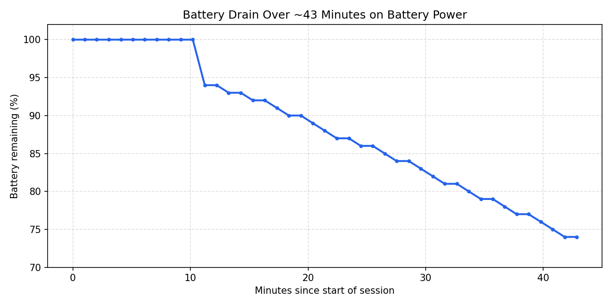

# Battery & Power Usage Analyzer

A Windows diagnostics tool written in C++ that monitors battery status and per-process CPU usage in real time, and cross-references them with Windows' own historical battery report — to identify what's actually driving battery drain on a device.

## Why I built this

I wanted hands-on experience with the Windows performance and power APIs that underpin tools like Task Manager and Windows Performance Analyzer, rather than only using the finished product. This project was also a deliberate way to practice the kind of work involved in analyzing telemetry/trace data and correlating it with device behavior — reading raw performance counters, handling their quirks, and turning them into an actual finding.

## What it does

The tool has three parts:

1. **Live battery monitor** — reads real-time battery percentage, AC/battery state, and charging status using the Windows Power API (`GetSystemPowerStatus`).
2. **Live process CPU monitor** — uses the Performance Data Helper (PDH) API to sample per-process CPU usage, normalized against the system's core count and aggregated across multi-instance processes (e.g. multiple `chrome.exe`/`msedge.exe` processes are summed under one name).
3. **Historical report parser** — parses the HTML output of `powercfg /batteryreport` to extract Windows' own power-state history (timestamps, AC/battery source, capacity remaining).

Running the main tool logs a snapshot (battery %, charging state, top CPU consumer) once per minute to `data/battery_log.csv`, building a time-series dataset you can analyze after a normal session of use.

## APIs and tools used

- **Windows Power API** — `GetSystemPowerStatus`
- **PDH (Performance Data Helper)** — `PdhOpenQuery`, `PdhEnumObjectItems`, `PdhAddCounter`, `PdhCollectQueryData`, `PdhGetFormattedCounterValue`
- **`powercfg /batteryreport`** — Windows' built-in historical battery/power-state report (HTML), parsed manually
- C++17, MSVC (Build Tools for Visual Studio)

## How to build and run

```bash
# Compile the main live monitor + logger
cl /std:c++17 src\battery_analyzer.cpp /Fe:battery_analyzer.exe
battery_analyzer.exe

# Compile the historical report parser (run powercfg /batteryreport /output "report.html" first)
cl /std:c++17 src\report_parser.cpp /Fe:report_parser.exe
report_parser.exe
```

`battery_analyzer.exe` logs continuously (once per minute) until stopped with `Ctrl+C`. Output is written to `data/battery_log.csv`.

## Findings

I ran the tool for ~43 minutes on battery power during a normal working session (browser tabs, VS Code, this Claude desktop app open). A few things stood out:



- **Battery dropped from 100% to 74% in ~43 minutes** — a sustained drain rate of roughly **36%/hour** on battery.
- **Drain was very steady** (~1%/minute) apart from a single anomalous jump (100%→94% in one minute, right after unplugging) that doesn't correspond to any CPU spike in the process data — most likely a battery-percentage recalibration artifact rather than real usage, worth noting as a limitation of relying on the reported percentage alone.
- **Tallying which process was the top CPU consumer across all 43 samples**, the Claude desktop app was actually the single most frequent top consumer (14 of 43 samples), ahead of Microsoft Edge (10) and Chrome (6) — a reminder to actually look at the data rather than assume the browser is always the biggest draw.
- **`svchost.exe` occasionally showed large spikes** (e.g. 187% in one sample) since Windows runs many unrelated background services inside shared `svchost.exe` processes, which this tool sums together under one name. This is a known limitation — a burst of legitimate background activity (indexing, Defender, updates) can look larger than any single foreground app, and current aggregation doesn't distinguish which service inside `svchost` is responsible.

## Known limitations / next steps

- `svchost.exe` aggregation doesn't break down which underlying service is responsible for a spike — would need ETW-level tracing to go further.
- The tool currently reports the single top process per sample rather than a ranked history over time.
- No GUI/visualization yet — findings above were derived by reviewing the logged CSV directly.

## Project structure

```
battery-power-analyzer/
├── src/
│   ├── battery_analyzer.cpp   # live battery + process CPU monitor, CSV logger
│   └── report_parser.cpp      # parses powercfg /batteryreport HTML output
├── data/                      # logged CSV output (gitignored)
├── README.md
└── LICENSE
```
